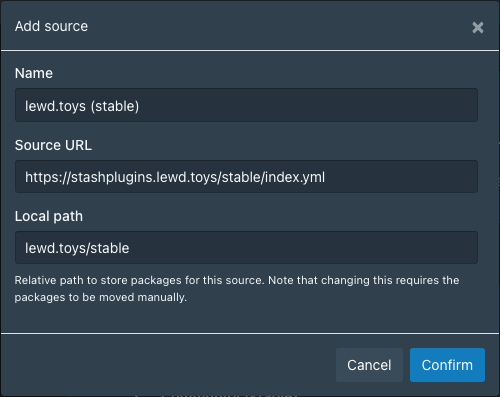
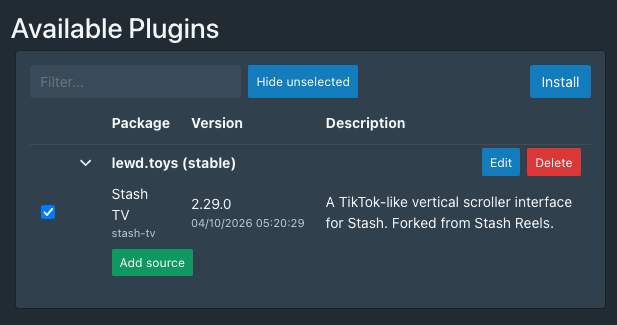

# Stash Plugins
This repository contains plugins for [Stash](https://docs.stashapp.cc/).

## Installing

Plugins can be installed and managed from the **Settings** > **Plugins** page.

Plugins are installed using the **Available Plugins** section. First this repo must be added as a source. To do so click
**Add Source** and enter the following details:

**Name:**
```
lewd.toys (stable)
```
**Source URL:**
```
https://stashplugins.lewd.toys/stable/index.yml
```
**Local Path:**
```
lewd.toys/stable
```

Like this: 

<p align="center">
   
</p>

Plugins can then be installed from the new **lewd.toys (stable)** section. 

<p align="center">
   
</p>
<p align="center">

Once installed plugins can be 
updated or uninstalled from the **Installed Plugins** section.

### Installing manually

By default, Stash looks for plugin configurations in the plugins sub-directory of the directory where the stash config.yml is read. This will either be the `%USERPROFILE%\.stash\plugins` on Windows or `/root/.stash/plugins` on Unix systems (Mac, Linux, etc.) or the current working directory.

Plugins are added by adding configuration yaml files (format: `pluginName.yml`) to the plugins directory.

Loaded plugins can be viewed in the **Settings** > **Plugins** page. After plugins are added, removed or edited while
Stash is running, they can be reloaded by clicking **Reload plugins** button.
